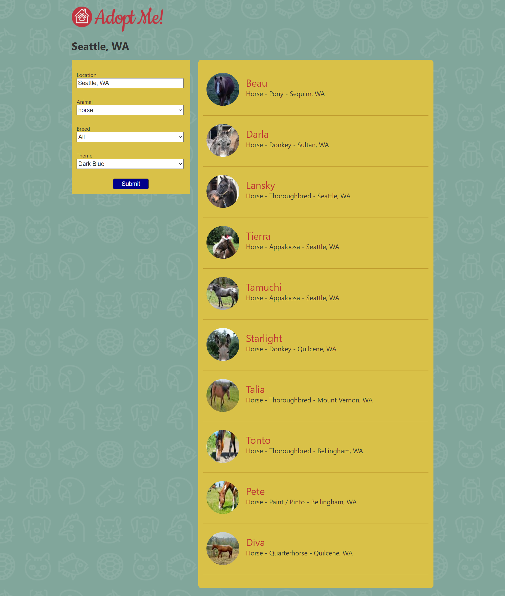

## Experience

---

[GirlScript Summer of Code](pdf/gssoc.pdf)
## GirlScript Summer of Code Participant
### February 2021 - Present (3 months)
### ->Working with an open-source organization on a three-month programming project.
### -> Aiming to enhance my software development skills.

---
[ForDailyWagers](/pdf/fordaily.pdf)
## Web Development Intern
### September 2020 - October 2020 (2 months)
### -> Contributed to converting UI/UX design of the Official Website of the company into a Fully Responsive Website, through design discussions, code reviews, and commits.
### -> Identified steps to increase the coding efficiency
### -> implemented the website in HTML CSS and JS

#### Things I learned:
- Working in an agile team
- Pair Programming with other Developers
- Maintaining the codebase on Github

---
[Ramrao Adik Institute of Technology](/pdf/rait.pdf)
## Research And Development Intern
### June 2020 - July 2020 (2 months)
### -> Participated in Summer Internship Program focused on learning, implementing, and developing innovative software solutions.
#### Events I was part of:
- Competitive Programming
- Training sessions on topics like software recruitments engineering, core web
development.

---

### Projects

- [Pet Adoption Website Using ReactJS](images/pet.png)
- [Restarant Wesite Using ReactJS](images/rest.png)
- [Content Management System Using PHP and HTML](images/bank.png)
- [Stock Management System Using Django](images/stock.png)

---

